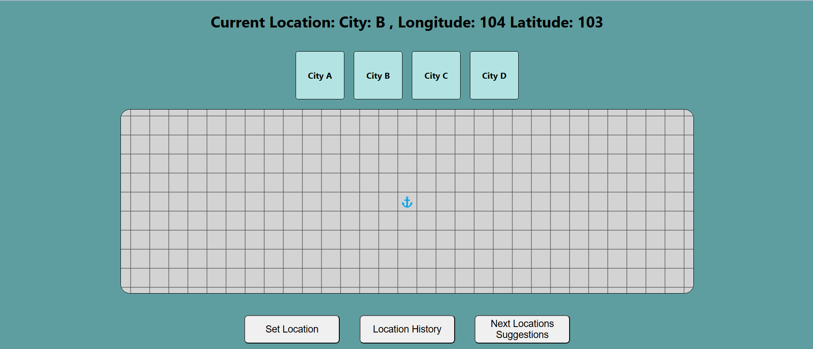
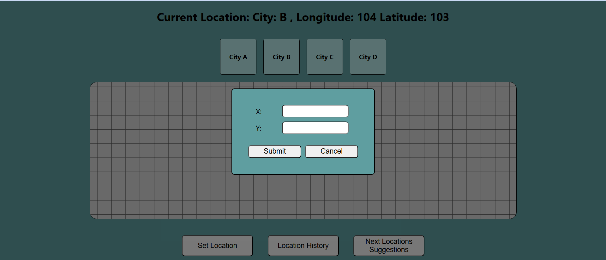
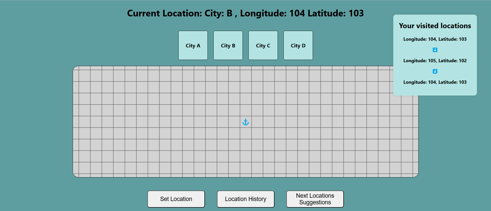
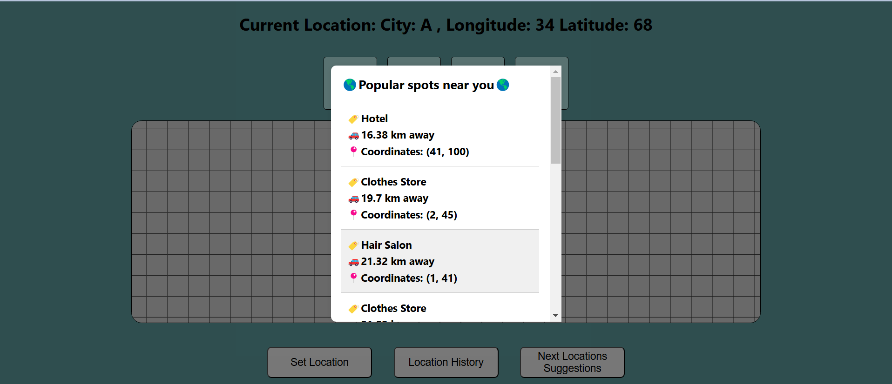

# SC4020_Project_2
# Task 1 

## Overview
The objective of **Task 1** was to identify the common combinations of POIs that frequently co-occur within the same grid and analyze these patterns of different POIs within each city. This was done with the implementation of the **Apriori algorithm** that was able to achieve our goal of identifying the common combinations of POIs.

## Data Preprocessing

### 1. Basket Creation
- **Creation of grid_id column**: Created a new column 'grid_id' by combining the 'x' and 'y' coordinates of each grid cell.
- **Grouping by grid_id column**: Grouped the data by the 'grid_id' column to get lists of POI categories present for their corresponding grid cells.

### 2. One-Hot Encoding
- **Creation of one-hot encoded baskets**: Encoding each basket to have a one-hot encoded row. If the POI was present within the grid cell it will have the value of '1' and if it was not present it will have the value of '0'

## Apriori Algorithm
Used the mlxtend.frequent_patterns.apriori API to mine frequent itemsets.

### Algorithm Steps

#### Generate F₁:
1. Compute support for all 1-itemsets.
2. Retain those with support ≥ 'min_support'.

#### Candidate Generation (Cₖ₊₁):
1. Combine frequent k-itemsets to create candidate (k+1)-itemsets.

#### Support Counting:
1. Evaluate candidate support using a mask to count occurrences across grid cells.

#### Candidate Elimination:
1. Remove candidates with support below 'min_support'.

#### Iterate:
1. Repeat steps until no more frequent itemsets are found.

### Association Rule Mining
We used the `mlxtend.frequent_patterns.association_rules` API to generate association rules. The following parameters were used:
- `metric = "lift"`
- `min_threshold = 1`  
This ensures that the occurrence of A and B in the rule A → B is positively correlated.

## Results Summary
We present the top 3 association rules (by lift) for each city, omitting the inverse of each rule (B → A) as they have the same lift.

| Rank | City A                           | City B                            | City C                                | City D                                        |
|------|----------------------------------|-----------------------------------|---------------------------------------|-----------------------------------------------|
| 1    | Real Estate → Hair Salon: **1.91** | Hair Salon → Laundry: **3.49**    | Hair Salon → Transit Station, Real Estate: **2.24** | Hospital → Hair Salon: **3.20**               |
| 2    | Real Estate → Building Material: **1.65** | Real Estate → Hair Salon: **3.38** | Hair Salon → Park, Real Estate: **2.22** | Real Estate → Laundry: **2.99**              |
| 3    | Building Material → Hair Salon: **1.60** | Hair Salon → Building Material, Transit Station: **3.26** | Real Estate → Park, Hair Salon: **2.19** | Building Material, Transit Station → Hair Salon: **2.86** |

This table summarizes the strongest associations (by lift) between Points of Interest (POIs) for each city, rounded to two decimal places for clarity.

# Task 2: Mining Sequential Patterns

## Overview
The objective of **Task 2** was to analyze the movement sequences of residents in four different cities (A, B, C, and D) to uncover common patterns of mobility using sequential pattern mining techniques. By preprocessing raw GPS data into structured triplegs and applying the **Generalized Sequential Pattern (GSP) algorithm**, we identified frequent movement patterns across each city.

## Data Preprocessing
To prepare the raw data for analysis, we implemented a systematic preprocessing workflow:

### 1. Data Cleaning
- **Missing Data Removal**: Filtered out invalid data points that which coordinates are marked as `-999`.
- **Timestamp Creation**: Standardized the timestamp format by combining date (`d`) and time (`t`) columns to form the `tracked_at` column.
- **Column Renaming**: Renamed key columns (`uid` to `user_id`, `x` and `y` to `longitude` and `latitude`) to match Trackintel’s required input format.

The cleaned data was then used to generate position fixes, which serve as the basis for identifying staypoints and triplegs. The full preprocessing flow is as follows:
**Raw Data → Preprocessed Data → Position Fixes → Staypoints → Triplegs**

### 2. Position Fixes Generation
We utilized trackintel's `read_positionfixes_csv` to read the preprocessed data to positionfixes, which are then used to generate staypoints and triplegs

### 3. Staypoints Generation
We generated staypoints using Trackintel's `generate_staypoints` function, fine-tuning parameters like gap and time thresholds to capture meaningful stops.

### 4. Triplegs Generation
With the staypoints identified, we used Trackintel's `generate_triplegs` function to extract triplegs, representing segments of continuous movement between distinct staypoints. 

## Data Analysis with GSP Algorithm
With the preprocessed triplegs data, we applied the **GSP algorithm** to discover frequent sequential patterns in residents' movements, providing insights into common mobility behaviors across the four cities.

## Results Summary
The GSP algorithm successfully identified frequent movement patterns across all four cities. Below is a summary of the results:

| City   | Frequent Sequences Generated | Average Sequence Length |
|--------|------------------------------|-------------------------|
| **A**  | 22,270                       | 2.21                    |
| **B**  | 14,099                       | 2.43                    |
| **C**  | 10,672                       | 2.42                    |
| **D**  | 6,591                        | 2.24                    |

By leveraging the Trackintel library for staypoint and tripleg generation and applying the GSP algorithm, we were able to uncover meaningful mobility patterns across different cities. These patterns provide valuable insights into residents' movement behaviors and serve as a foundation for predicting the next location in Task 3.

# Task 3 : POI Navigator

## Overview
**POI Navigator** is an intelligent location-based application designed to enhance users' exploration experiences by providing personalized suggestions for points of interest (POIs) within a city. Leveraging data mining and machine learning techniques, the app analyzes users' current locations and movement histories to offer relevant and accurate recommendations for places to visit.

### Key Features
- **City Selection**: Choose a city (A, B, C, or D) to explore.
- **Set Location**: Users can set their current location on the map.
- **View Location History**: Keep track of previously visited locations in the same city.
- **Next Location Suggestion**: Get personalized recommendations for the next POI to visit.

### Main UI

### Coordinate Box

### Location History

### Suggestion List

## Project Structure
1. **Frontend**: Built with React for a fast and responsive UI.
2. **Backend**: Built with Flask, integrating with an LSTM model for next-location suggestions based on user movement patterns.

## Prerequisites
Ensure you have the following installed:
- **Node.js** (version 20 or higher)
- **Flask** (Python 3.x)

## How to run the application

1. Clone this Repository
2. cd Task_3

##  To run the frontend server
1. cd Frontend
2. npm start

## To run the backend server
1. cd Backend
2. python main.py
